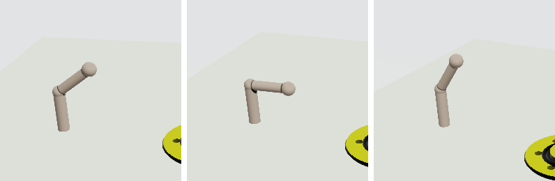

# Makina

CSG ソリッドモデラー。距離場（SDF）を直接レイマーチする DX12 レンダラと、
**形状そのものから経年変化を導出する**マテリアルを持つ。

教育用ツール Grasp3D（Java / JOGL / POV-Ray）の C++ 移植から始まり、
移植の一致検証をそのまま「3 通りの独立実装が同じ形を描く」証明に使っている。

自作ゲームエンジン **MitiruEngine** の姉妹プロジェクト。
ここで作ったモデルはエンジン側で描画にも衝突判定にも使える（同じ距離場から出る）。

---

## 1. 何が新しいのか

### 1.1 経年変化がテクスチャではない

摩耗も汚れも埃も、**距離場から計算される**。UV も、ベイクも、テクスチャも無い。

| マスク | 何から出るか |
|---|---|
| 摩耗（磨かれた縁） | 正のカーバチャ × 露出（AO） |
| 汚れ（溜まる） | 低い AO × 非凸 |
| 汚れ（流れ落ちる） | 上向きへのソフトシャドウ（空遮蔽）× 非水平 |
| 埃 | 上向き × 開けている × 摩耗していない |
| 透過 | 薄さ（内向きマーチ） |

**形を変えると、同じフレームで摩耗が付いて回る。**
溝の半径を動かすと汚れの溜まる場所が動き、溝がボルト穴と交わればその交点に汚れが溜まる。
ベイクしたテクスチャには言えない主張である。

詳細: [docs/WEATHERING.md](docs/WEATHERING.md)

### 1.2 AI が自分の仕事を数値で確かめられる

```
makina_edit describe <scene.json>     ツリー（id と名前付きパラメータ）
makina_edit apply    <scene.json> <commands.json> -o <out.json>
makina_edit measure  <scene.json>     隙間・干渉・浮き・対称性
```

絵しか見られないエージェントは「動かしたボスがボアを避けているか」を推測するしかない。
`measure` を叩けるエージェントは数字を得る。

巻き戻しは**厳密**。シーンは 1 個の trivially-copyable な struct なので、
スナップショットはコピーそのもので、コマンドに逆操作を持たせる必要が無い。

詳細: [docs/AGENT_API.md](docs/AGENT_API.md)

---

## 2. 正しさをどう示しているか

同じ形状を**互いにコードを共有しない 3 通り**で表現して突き合わせる。

| 系統 | 何を答えるか | 検証 |
|---|---|---|
| SDF | 表面までの距離 | Java 参照実装と 51,137 サンプル一致 |
| B-rep（BSP） | 内か外か | SDF と **156,932 サンプル一致** |
| レイトレ（POV-Ray） | 画素 | SDF と**シルエット IoU 0.9949〜0.9996** |

**壊れ方が違う**のが要点である。
SDF はブーリアンで「もはや距離でない数」を合成して間違え、
B-rep は同一平面上の面でポリゴンを落として間違える。同じ間違いはしない。

シルエットを比べるのは、それが**ジオメトリ・変換・カメラ・利き手だけ**に依存するから。
1 つの数字で 4 つを同時に検査できる。右手系のシーンを左手系で描いていれば IoU はほぼ 0 になる。

```bash
verify-all.bat
```

参照ダンプの生成から GPU の突き合わせまで一括で走る。最後に `everything agrees` が出る。

詳細: [docs/PORT_STATUS.md](docs/PORT_STATUS.md)

---

## 3. 構成

```
makina-core/     ヘッドレス。GPU もエンジンも知らない。ヘッダーオンリー
  include/makina/
    Sdf.hpp        C++ と HLSL が共有するプリミティブ距離関数（1 つの定義）
    Warp.hpp       同上、空間のねじり・曲げ・絞り（Twist / Bend / Taper、D-14）
    Eval.hpp       CPU 評価器
    Flatten.hpp    ツリー → RPN 評価プログラム（変換の焼き込み・平衡二分化）
    Bounds.hpp     ブーリアンを尊重した AABB
    Measure.hpp    隙間・干渉・浮き・対称性
    Bsp.hpp        BSP ブーリアン（第 2 実装）
    Pov.hpp        POV-Ray 出力（第 3 実装）、PovImport.hpp はその逆
    MeshExport.hpp B-rep をそのまま STL / OBJ に
    Animation.hpp  関節のキーと sampleAt(t)（D-15）。時間を知る唯一の場所
    Edit.hpp       id 指定のツリー編集
    History.hpp    スナップショット履歴
    Command.hpp    JSON コマンド（ビューポートの全編集はここを通る）
    Camera.hpp Pick.hpp Transform.hpp Selection.hpp Keymap.hpp ViewState.hpp
                   ビューポートの頭脳。ウィンドウ無しでテストできる
    Fidelity.hpp   Grasp3D と意図的に食い違う点、2 つだけ
  tools/makina_edit.cpp makina_mesh.cpp
  tests/           16 本。tests/scenes/ がフィクスチャ

app/             ビューポート（Win32 + DX12）と、CEF で描くシェル
  viewport/main.cpp   1 ウィンドウ。キーマップ・選択・変形・履歴・再生ヘッド
  ui/shell.html       Grasp3D の配置: ツールバー / ツリー / プロパティ / タイムライン
  keymap_audit.cpp    「キーマップの語彙をビューポートが全部実行するか」の門
  viewport-check.bat  キーを流し込み、保存されたツリーと絵で確かめる

spike/           DX12 レンダラ（レイマーチ・生成シェーダ・経年変化）と、
                 render_scene / makina_bake / 各 *-check.bat（POV 比較の門）
tools/           Grasp3D から参照ダンプを吐く Java ツール群、shell_audit.py
docs/            設計文書と docs/images/
```

**依存はこの向きにしかない**: `makina-core ← MitiruEngine`、`makina-core ← Makina`。
`makina-core` は標準ライブラリ以外に依存しないので、テストにデバイスもウィンドウも要らない。

---

## 4. 進捗

| Phase | 内容 | 状態 |
|---|---|---|
| S | 技術検証スパイク | ✅ コード生成で 4.9 倍、インタプリタ案を棄却 |
| 0 | 型設計・シーン記述 | ✅ |
| 1 | makina-core | ✅ |
| 2 | SDF レイマーチ（DX12） | ✅ |
| 3 | アプリ（CEF）と操作性 | ✅ ビューポート・シェル・アウトライナ・変形・多選択・保存/書き出し |
| 4 | 経年変化 | ✅ |
| 5 | 3 系統クロスチェック | ✅ CI 化を除く |
| 6 | エンジン統合 | ✅ 焼いた DXIL をエンジンが描き深度合成、動く立体も（D-15） |
| 7 | AI 編集 | コア側 ✅ / ブリッジは未着手 |
| 8 | Vulkan | 未着手 |
| D-14 | 空間ワープ（Twist / Bend / Taper） | ✅ POV isosurface と輪郭 IoU 0.99 |
| D-15 | 関節とモーション | ✅ Joint + キー、再生/キー打ち、live 焼きでエンジンで動く |



エンジン（MitiruEngine の csg_solid 章）で動く腕。肘に 3 つのキー、シェーダは 1 本のまま。

計画と決定記録: [PLAN.md](PLAN.md)

---

## 5. ビルドと起動

Windows / MSVC 14.51 (VS 18) / CMake + Ninja / DXC。全部 `.bat` で、vcvars は中で呼ぶ。

```bash
makina-core\build-and-test.bat
```

```bash
spike\build.bat
```

```bash
app\build-viewport.bat
```

ビューポートを立ち上げる（シーンは `.makina.json`。`tools\gsf2json\out\` と
`makina-core\tests\scenes\` に一式ある）:

```bash
app\build\bin\makina_viewport.exe makina-core\tests\scenes\arm.makina.json
```

- 既定は Maya のキーマップ（Alt+左ドラッグ orbit、Alt+中 pan、Alt+右 dolly、W/E/R 移動/回転/拡縮、
  F 選択にフィット、A 全体、Ctrl+Z / Ctrl+Y、Ctrl+S 保存）。`--keymap blender` で Blender 流
  （中ドラッグ orbit、G/R/S、X 削除、Shift+D 複製、Ctrl+Shift+Z やり直し）。
- 変形中に数字を打てば数値入力、X / Y / Z で軸、Enter で確定、Escape で取消。H でミュート。
- Space で再生 / 停止、K で選択ノードの全パラメータにキー、プロパティ欄の ◆ で 1 つだけキー。
  タイムラインのスライダで時刻をスクラブ。トラックが付いた欄に打った数字はその時刻のキーになる。
- ツールバー: プリミティブ / 変換 / ワープ / ブーリアンの追加、削除、ミュート、カメラ、距離、
  元に戻す / やり直す、保存、書き出し（.pov / .stl / .obj をシーンの隣に）。
- ウィンドウは最小化できる。`--frames N` の検査走行は最初から最小化で走る。

コマンドラインだけでも同じ編集ができる（Phase 7 の入口）:

```bash
makina-core\build\bin\makina_edit.exe describe makina-core\tests\scenes\arm.makina.json
```

参照ダンプの再生成には JDK 22 と Grasp3D のビルド済みクラス（`D:\sandbox\Grasp3D\bin`）が要る。
シルエット比較には POV-Ray（`Grasp3D\povray\bin\povray.exe`）が要る。POV-Ray のソースは
読まない（AGPL）— licence-check.bat が門になっている。

### エンジンで使う

```bash
spike\build\bin\makina_bake.exe scene.makina.json -o <engine>\examples\csg_solid\assets --shading scene_engine.hlsl
```

`--live` を足すと構造だけ特殊化したシェーダになり、エンジン側は `drawSolid(path, pos, rotY, scale, timeSec)`
で時刻の姿を描く。マニフェスト（`.csgbake.json`）のハッシュがシーンと合わないと描かない。

---

## 6. 30 秒のデモ（録画の手順）

1. `app\build\bin\makina_viewport.exe makina-core\tests\scenes\arm.makina.json` を起動する。
2. ツリーで **elbow** をクリック。プロパティに pivot と degree、degree の ◆ が塗られている（キー付き）。
3. **Space** — 肘が 2 秒で曲げ伸ばしを繰り返す。もう一度 Space で止める。
4. スライダを 0.5 s へ。degree の欄に `-45` と打つ → その時刻にキーが増え、Space で再生すると経路が変わる。
5. ツールバーの **Twist** を押す（選択が elbow のとき、その下に入る）。ツリーで **forearm** の行を Twist の
   行へドラッグして中に入れ、degreesPerUnit に `60` → 前腕がねじれたまま動く。空間ごと曲げるので、
   材質も経年変化も追従する。
6. **書き出し**ボタン → `arm.pov` / `arm.stl` / `arm.obj` がシーンの隣に出る。POV-Ray で `arm.pov` を描くと
   同じ形が出る（これが第 3 実装との突き合わせ）。
7. MitiruEngine 側で `mitiru_host.exe csg_solid/csg_solid.dll` — 床の上で同じ腕が動いている。

自動で撮るなら（見た目検査の経路そのもの）:

```bash
app\build\bin\makina_viewport.exe makina-core\tests\scenes\arm.makina.json --select 4 --actions "anim.scrub=1" --frames 150 --screenshot arm_t1.bmp
```

```bash
<engine>\build\apps\mitiru_host\mitiru_host.exe csg_solid/csg_solid.dll --max-frames 130 --capture-dir out --capture-every 30
```
